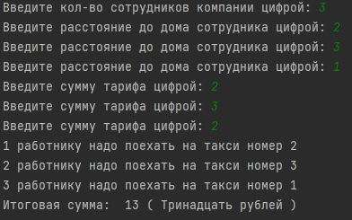
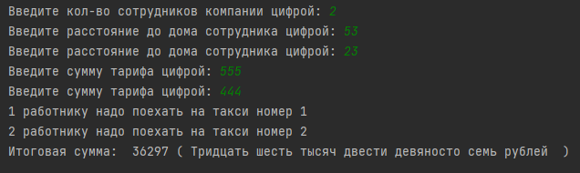

## Автор программы
Гвоздев Александр Максимович
Группа: Фт-210008
## Краткое описание. Лабораторная работа №4 - Такси
Программа распределяет сотрудников по такси с подсчетом наименьших затрат на него и выводит результаты распределения и общую стоимость поездок.
## Руководства пользования
Для запуска программы откройте файл main.py через любой IDE поддерживающий Pyton. 
## Тесты

